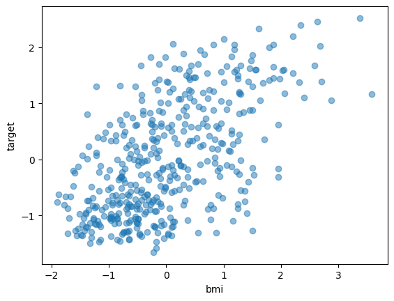
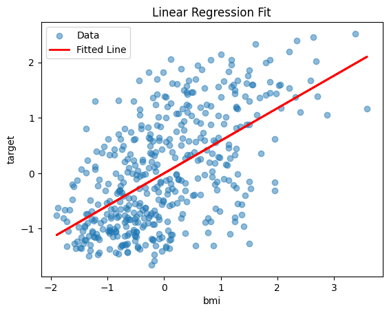
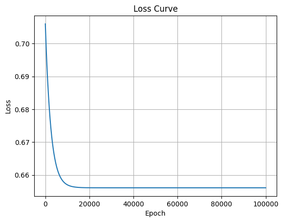

# linear-regression-from-scratch

A hands-on implementation of linear regression using both a from-scratch approach and scikit-learn, designed to help myself understand how linear regression works and how to visualize its learning process.

## Project Structure
```text
linear_regression/
├── scratch.py            # Linear regression from scratch (gradient descent)
├── sklearn_version.py    # scikit-learn version for comparison
├── visualize.py          # Visualize the input data
├── data.csv              # Dataset used for training
├── README.md             # Project description (this file)
└── requirements.txt      # Dependencies 
```

## Features
- Implements linear regression from scratch using NumPy
- Shows how to compute predictions, MSE loss, and gradients manually
- Includes scikit-learn implementation for comparison

## Full support for visualizing:
- Input data distribution
- Learned regression line
- Loss curve over training epochs

## Dataset Description
- The dataset used is a simplified version extracted from a sklearn diabetes dataset
- Only one feature(bmi) and the target are used to keep the visualization simple and interpretable
- The data is stored in data.csv

## Example Visualizations
- Training Data Scatter Plot 
- Regression Line Learned (Scratch Version) 
- Loss Curve 


